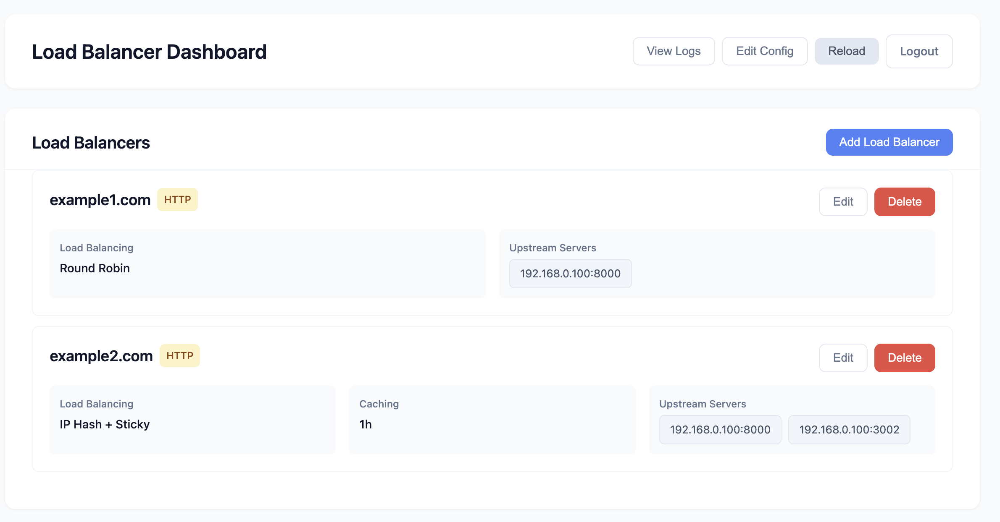
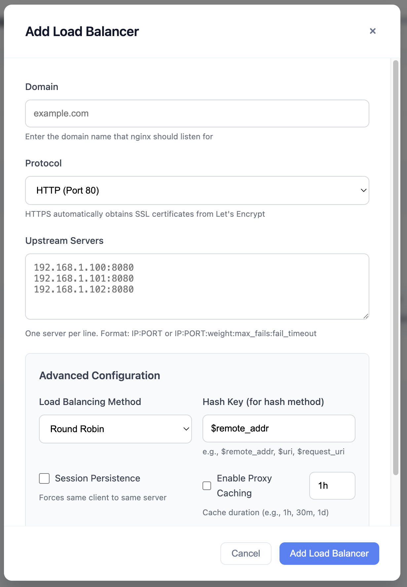
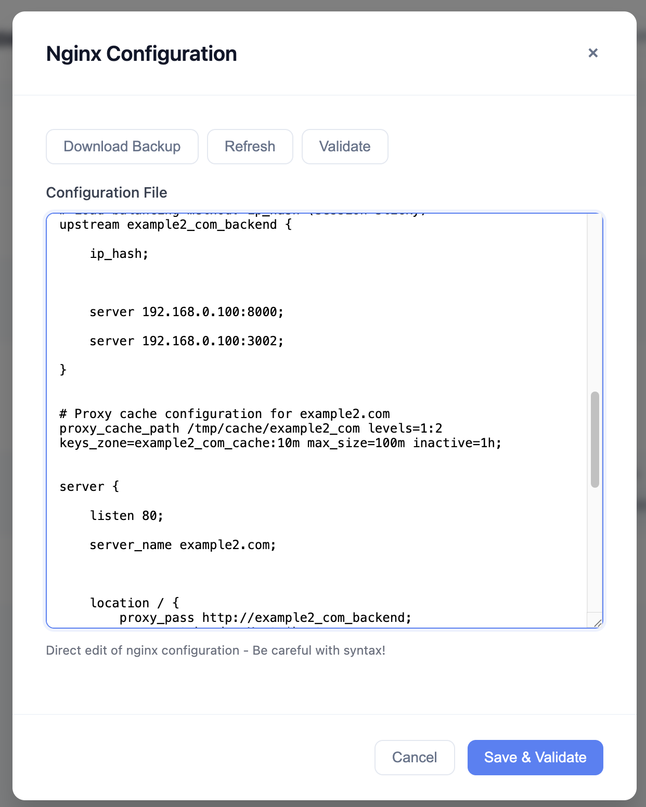

# 🚀 SimpleLB - Nginx Load Balancer with Let's Encrypt

A lightweight, Docker-based nginx load balancer with a clean web UI for managing multiple sites, featuring automatic SSL certificate generation via Let's Encrypt.

[](https://github.com/ddalcu/simplelb/actions/workflows/docker-build.yml)
[](https://opensource.org/licenses/MIT)

## ✨ Features

### 🔧 **Load Balancing**
- **Multiple Algorithms**: Round-robin, least connections, IP hash, custom hash
- **Health Checking**: Configurable max_fails and fail_timeout per server
- **Server Weights**: Distribute traffic based on server capacity (1-100)
- **Session Persistence**: Sticky sessions using IP hash

### 🔒 **SSL/HTTPS Support**
- **Automatic Let's Encrypt**: Zero-config SSL certificate generation
- **Certificate Management**: Automatic renewal every 60 days
- **Retry Functionality**: Manual certificate retry for failed attempts
- **HTTP → HTTPS Redirect**: Automatic traffic redirection

### 🎯 **Advanced Features**
- **Proxy Caching**: Configurable response caching with custom durations
- **Protocol Support**: HTTP and HTTPS with automatic certificate handling
- **Real-time Monitoring**: Live SSL certificate status tracking
- **Configuration Backup**: Download and restore nginx configurations

### 🖥️ **Web Interface**
- **Clean UI**: Intuitive dashboard for managing load balancers
- **Real-time Status**: Visual SSL certificate status indicators
- **Comprehensive Logs**: View nginx, application, and Let's Encrypt logs
- **Advanced Configuration**: Granular control over all load balancing options

## 📸 Screenshots

### Dashboard Overview

*Main dashboard showing load balancers with real-time SSL status and configuration details*

### Add Load Balancer Modal

*Clean, modern interface for adding new load balancers with advanced configuration options*

### System Logs Viewer

*Comprehensive log viewer for nginx, application, and Let's Encrypt certificate logs*

### Nginx Configuration Editor

*Direct nginx configuration editing with validation and backup capabilities*

## 🚀 Quick Start

### Using Docker Compose (Recommended)

1. **Create docker-compose.yml**:
```yaml
services:
  nginx-loadbalancer:
    image: ghcr.io/ddalcu/simplelb:latest
    ports:
      - "80:80"    # HTTP traffic
      - "443:443"  # HTTPS traffic  
      - "8080:81"  # Management UI (8080 within container 81 exposed on host)
    environment:
      - ADMIN_USERNAME=admin
      - ADMIN_PASSWORD=your-secure-password
      - NGINX_PORT=80
      - MANAGEMENT_PORT=81
    volumes:
      - ./data:/app/data
    restart: unless-stopped
```

2. **Start the service**:
```bash
docker-compose up -d
```

3. **Access the web interface**:
   - Open http://localhost:8080
   - Login with your configured credentials
   - Start adding load balancers!

### Using Docker Run

```bash
docker run -d \
  --name simplelb \
  -p 80:80 -p 443:443 -p 8080:81 \
  -e ADMIN_USERNAME=admin \
  -e ADMIN_PASSWORD=your-secure-password \
  -v $(pwd)/data:/app/data \
  ghcr.io/ddalcu/simplelb:latest
```

## 📋 Usage Guide

### Creating Load Balancers

1. **Access Management UI**: Navigate to http://your-server:8080
2. **Add Load Balancer**: Click "Add Load Balancer" 
3. **Configure Settings**:
   - **Domain**: Enter your domain (e.g., `example.com`)
   - **Protocol**: Choose HTTP or HTTPS
   - **SSL Email**: Required for HTTPS (Let's Encrypt notifications)
   - **Upstream Servers**: List your backend servers
   - **Advanced Options**: Configure load balancing method, caching, etc.

### Upstream Server Format

Basic format: `IP:PORT`
```
192.168.1.100:8080
192.168.1.101:8080
192.168.1.102:8080
```

Advanced format: `IP:PORT:weight:max_fails:fail_timeout`
```
192.168.1.100:8080:3:5:15s
192.168.1.101:8080:1:3:10s
192.168.1.102:8080:2:3:10s
```

### Load Balancing Methods

- **Round Robin** (default): Distributes requests evenly across servers
- **Least Connections**: Routes to server with fewest active connections
- **IP Hash**: Routes based on client IP (enables session persistence)
- **Hash**: Routes based on custom variables (`$uri`, `$remote_addr`, etc.)

### SSL Certificate Management

For HTTPS load balancers:
1. **Domain DNS**: Ensure your domain points to this server's IP
2. **Email Required**: Provide valid email for Let's Encrypt notifications
3. **Automatic Generation**: Certificates are requested automatically
4. **Monitor Status**: Check certificate status in the dashboard
5. **Manual Retry**: Use "Retry SSL" button for failed certificates

## 🔧 Configuration

### Environment Variables

| Variable | Default | Description |
|----------|---------|-------------|
| `ADMIN_USERNAME` | `admin` | Web interface username |
| `ADMIN_PASSWORD` | `password` | Web interface password |
| `NGINX_PORT` | `80` | HTTP port for load balanced traffic |
| `MANAGEMENT_PORT` | `81` | Web interface port |

### Volume Mounts

| Path | Purpose |
|------|---------|
| `/app/data` | Unified data directory (nginx configs, SSL certificates, logs) |

## 📊 Monitoring & Logs

The web interface provides comprehensive logging:

### 🌐 **Nginx Logs**
- **Error Logs**: nginx server errors and warnings
- **Access Logs**: HTTP request logs and access patterns

### ⚙️ **Application Logs**  
- **App Errors**: Go backend errors and certificate generation
- **App Access**: HTTP API requests and debugging info

### 🔒 **Let's Encrypt Logs**
- **Certificate Logs**: Complete certbot execution logs
- **ACME Challenges**: Domain validation and certificate issuance

## 🏗️ Architecture

```
┌─────────────────┐    ┌─────────────────┐
│   Internet      │    │  Management UI  │
│   Traffic       │    │   (Port 81)     │
└─────────┬───────┘    └─────────────────┘
          │                      │
┌─────────▼───────┐              │
│     Nginx       │              │
│  (Ports 80/443) │              │
│                 │              │
│  Load Balancer  │◄─────────────┘
│  SSL Termination│
└─────────┬───────┘
          │
┌─────────▼───────┐
│   Upstream      │
│    Servers      │
│                 │
│ 192.168.1.100:8080
│ 192.168.1.101:8080
│ 192.168.1.102:8080
└─────────────────┘
```

### 📁 **Data Directory Structure**

All application data is stored in a single unified directory `/app/data`:

```
data/
├── nginx/                  # Nginx configuration files
│   └── loadbalancer.conf   # Generated load balancer config
├── letsencrypt/            # SSL certificates & Let's Encrypt data
│   ├── live/              # Active certificates
│   ├── archive/           # Certificate archive
│   └── renewal/           # Auto-renewal configs
├── certbot/               # ACME challenge files
└── logs/                  # All application logs
    ├── nginx-access.log   # Nginx access logs
    ├── nginx-error.log    # Nginx error logs
    ├── app-access.log     # Application logs
    ├── app-error.log      # Application errors
    └── letsencrypt.log    # Certificate generation logs
```

This unified structure makes it easy to:
- **Backup**: Single directory contains all persistent data
- **Deploy**: Mount one volume for complete data persistence  
- **Debug**: All logs centralized in one location

## 🔒 Security Features

- **Authentication**: Secure web interface with session management
- **SSL/TLS**: Automatic HTTPS with modern TLS protocols (1.2, 1.3)
- **Security Headers**: HSTS, secure cipher suites, OCSP stapling
- **Certificate Validation**: Automatic Let's Encrypt domain validation
- **Configuration Validation**: nginx config testing before reload

## 🛠️ Development

### Prerequisites
- Docker & Docker Compose
- Go 1.21+ (for local development)

### Local Development
```bash
# Clone repository
git clone https://github.com/ddalcu/simplelb.git
cd simplelb

# Build and run
docker-compose up --build

# View logs
docker-compose logs -f
```

### Project Structure
```
.
├── main.go                 # Go backend application
├── templates/              # HTML templates
│   └── dashboard.html      # Web interface
├── Dockerfile             # Container definition
├── docker-compose.yml     # Service configuration
├── supervisord.conf       # Process management
├── start.sh              # Container startup script
└── nginx.conf.template   # Base nginx configuration
```

## 🤝 Contributing

We welcome contributions! Please see [CONTRIBUTING.md](CONTRIBUTING.md) for guidelines.

### Development Setup
1. Fork the repository
2. Create a feature branch
3. Make your changes
4. Test thoroughly
5. Submit a pull request

## 📄 License

This project is licensed under the MIT License - see the [LICENSE](LICENSE) file for details.

## 🆘 Support

- **Documentation**: Check this README and inline help
- **Issues**: [GitHub Issues](https://github.com/ddalcu/simplelb/issues)
- **Discussions**: [GitHub Discussions](https://github.com/ddalcu/simplelb/discussions)

## 🎯 Roadmap

- [ ] Multi-domain SSL certificates (SAN)
- [ ] Metrics and Prometheus integration
- [ ] API-only mode (headless operation)
- [ ] Kubernetes deployment manifests
- [ ] Advanced routing rules (path-based, header-based)
- [ ] Load balancer templates and presets

---

**Made with ❤️ for the open source community**

*Secure, scalable, and simple load balancing for everyone.*