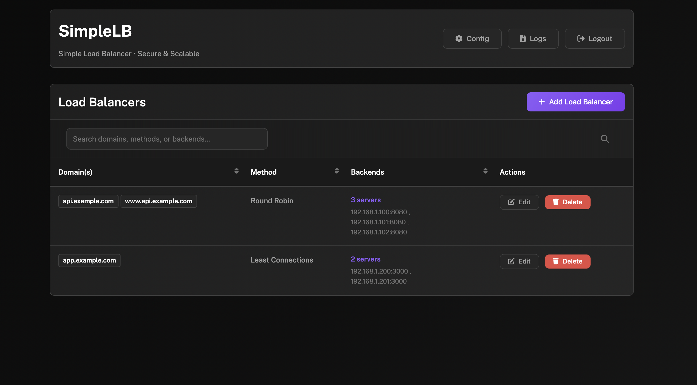

# 🏠 SimpleLB - Simple Load Balancer for Home Labs

A lightweight, Docker-based load balancer built with **Caddy** and **Go**, featuring automatic SSL certificates and a clean web interface. Perfect for home labs and small deployments.

[](https://opensource.org/licenses/MIT)
[](https://golang.org)

## 🚀 Quick Start

### Docker Compose (Recommended)
```yaml
services:
  simplelb:
    image: ghcr.io/ddalcu/simplelb:latest
    ports:
      - "80:80"    # HTTP
      - "443:443"  # HTTPS
      - "81:81"    # Management UI
    environment:
      - ADMIN_USERNAME=admin
      - ADMIN_PASSWORD=your-secure-password
      - ACME_EMAIL=your-email@example.com
    volumes:
      - ./data:/app/data
    restart: unless-stopped
```

### Docker One-liner
```bash
docker run -d --name simplelb -p 80:80 -p 443:443 -p 81:81 -v $(pwd)/data:/app/data -e ADMIN_USERNAME=admin -e ADMIN_PASSWORD=your-secure-password -e ACME_EMAIL=your-email@example.com ghcr.io/ddalcu/simplelb:latest
```

**Then visit:** https://localhost:81 (accept the self-signed certificate warning)

## ✨ Features

### 🔧 **Load Balancing**
- Multiple algorithms: Random, Round Robin, Least Connections, First Available, IP Hash, Header Hash, Cookie Hash
- Real-time configuration updates via Caddy's admin API
- Persistent configuration across restarts

### 🔒 **Automatic HTTPS**
- Let's Encrypt integration with automatic certificate provisioning
- Background certificate renewal
- HTTP → HTTPS redirects
- Multi-domain support

### 🖥️ **Web Interface**
- Clean, responsive dashboard
- Easy load balancer management
- Real-time log viewing
- No CLI required

## 📸 Screenshots

### Dashboard Overview

*Simple dashboard for managing your load balancers*

### Add Load Balancer

*Easy form to add new load balancers*

### System Logs

*View application and Caddy logs in real-time*

## 🚀 Quick Start

### Using Docker Compose (Recommended)

1. **Create docker-compose.yml**:
```yaml
services:
  caddy-lb:
    build: .
    ports:
      - "80:80"          # HTTP traffic
      - "443:443"        # HTTPS traffic
      - "81:81"          # Management web interface
      - "2019:2019"      # Caddy Admin API
    environment:
      # Management Interface Authentication
      - ADMIN_USERNAME=admin
      - ADMIN_PASSWORD=password
      - MANAGEMENT_PORT=81
      
      # Security Configuration
      - SESSION_SECRET=your-super-secret-session-key-change-this-in-production
      - SESSION_COOKIE_SECURE=0       # Set to 1 for HTTPS in production
      
      # SSL/TLS Configuration
      - ACME_EMAIL=admin@example.com  # Email for Let's Encrypt certificates
      
      # Caddy Integration
      - CADDY_ADMIN_URL=http://127.0.0.1:2019  # Caddy Admin API URL
    volumes:
      - ./data:/app/data
    restart: unless-stopped
```

2. **Start the service**:
```bash
docker-compose up -d
```

3. **Access the web interface**:
   - Open https://localhost:81 (accept the self-signed certificate warning)
   - Login with your configured credentials
   - Start creating load balancers!

   **Note**: The management interface uses HTTPS with a self-signed certificate for security. Your browser will show a security warning - this is normal for self-signed certificates.

### Using Docker Build

```bash
# Clone the repo
git clone <your-repo-url>

# Build and run
docker-compose up --build -d
```

### One-liner Docker Command

```bash
# Build and run with Docker (without compose)
docker build -t simplelb . && docker run -d --name simplelb -p 80:80 -p 443:443 -p 81:81 -p 2019:2019 -v $(pwd)/data:/app/data -e ADMIN_USERNAME=admin -e ADMIN_PASSWORD=password -e ACME_EMAIL=admin@example.com simplelb
```

## 📋 How to Use

### Creating Load Balancers

1. **Access Management UI**: Navigate to https://your-server:81
2. **Login**: Use your configured username/password (accept self-signed certificate warning)
3. **Add Load Balancer**: Click "Add Load Balancer" 
4. **Configure Settings**:
   - **Domain**: Enter your domain (e.g., `api.homelab.local`)
   - **Backend Servers**: Add your upstream servers (one per line)
   - **Load Balancing Method**: Choose your preferred algorithm
   - **Hash Key**: For header/cookie-based load balancing (if applicable)

### Backend Server Format

Simple format - one server per line:
```
192.168.1.100:8080
192.168.1.101:8080  
192.168.1.102:8080
```

### Load Balancing Methods

- **Random** (default): Randomly distribute requests
- **Round Robin**: Even distribution across all servers
- **Least Connections**: Routes to server with fewest active connections  
- **First Available**: Always use the first healthy server
- **IP Hash**: Client IP-based routing (session persistence)
- **Header Hash**: Route based on HTTP header value
- **Cookie Hash**: Route based on cookie value

### SSL/HTTPS Setup

For automatic HTTPS:
1. **Domain DNS**: Point your domain to this server's IP
2. **Email Required**: Set `ACME_EMAIL` for Let's Encrypt notifications
3. **Port 443**: Make sure port 443 is accessible from the internet
4. **Wait**: Certificates are provisioned automatically

## 🔧 Configuration

### Environment Variables

| Variable | Default | Description |
|----------|---------|-------------|
| `ADMIN_USERNAME` | `admin` | Web interface username |
| `ADMIN_PASSWORD` | `password` | Web interface password |
| `MANAGEMENT_PORT` | `81` | Web interface port |
| `SESSION_SECRET` | *default* | Session encryption key |
| `SESSION_COOKIE_SECURE` | `0` | Set to `1` for HTTPS |
| `ACME_EMAIL` | `admin@example.com` | Let's Encrypt email |
| `CADDY_ADMIN_URL` | `http://127.0.0.1:2019` | Caddy Admin API |

Copy `.env.example` to `.env` and customize for your setup.

### Data Persistence

All data is stored in `/app/data`:
- **Configuration**: Saved automatically and restored on restart
- **SSL Certificates**: Stored in `/app/data/caddy/data/`
- **Logs**: Application and Caddy logs in `/app/data/logs/`
- **Management TLS**: Self-signed certificates in `/app/data/certs/`

## 🔒 Security Features

### Management Interface Security
- **HTTPS Only**: Management interface runs on HTTPS with TLS 1.2+
- **Self-Signed Certificates**: Auto-generated certificates for secure communication
- **Secure Session Cookies**: HTTP-only, secure session management
- **Basic Authentication**: Username/password protection for all endpoints

### TLS Configuration
- **Strong Ciphers**: Modern cipher suites (ECDHE, ChaCha20-Poly1305, AES-GCM)
- **Certificate Validation**: Automatic certificate expiry checking and renewal
- **Secure Headers**: Security headers applied to all responses

### Network Security
- **Isolated Management**: Management interface separate from load balancing traffic
- **Encrypted Communication**: All admin communication encrypted via HTTPS

## 🏗️ Architecture

### System Overview


### Request Flow


### Configuration Management


## 📁 Directory Structure

```
/app/data/
├── logs/
│   ├── caddy/          # Caddy access/error logs
│   ├── simplelb/        # Application logs
│   └── supervisor/     # Process management logs
├── caddy/
│   ├── data/          # SSL certificates, TLS data
│   └── config/        # Configuration snapshots
└── certs/             # Management interface TLS certificates
    ├── server.crt     # Self-signed certificate
    └── server.key     # Private key
```

## 🔌 API Documentation

SimpleLB provides a REST API for programmatic management of load balancers.

### Authentication
All API endpoints require HTTP Basic Authentication using your configured admin credentials.

```bash
curl -k -u admin:password https://localhost:81/dashboard
```

**Note**: Use the `-k` flag to accept the self-signed certificate.

### Endpoints

#### Get All Load Balancers
```http
GET /dashboard
```
**Description**: Returns the dashboard page with all load balancers
**Response**: HTML page with load balancer list

#### Get Load Balancer Details
```http
GET /edit/:domain
```
**Description**: Get configuration for a specific load balancer
**Parameters**:
- `domain` (path): Domain name of the load balancer

**Response**:
```json
{
  "domain": "api.homelab.local",
  "method": "round_robin",
  "backends": "192.168.1.100:8080\n192.168.1.101:8080"
}
```

#### Create Load Balancer
```http
POST /add
```
**Description**: Create a new load balancer
**Content-Type**: `application/x-www-form-urlencoded`

**Parameters**:
- `domain` (string): Domain name (e.g., "api.homelab.local")
- `backends` (string): Backend servers, one per line
- `method` (string): Load balancing method ("random", "round_robin", "least_conn", "first", "ip_hash", "header", "cookie")
- `hash_key` (string): Hash key for header/cookie methods (optional)

**Example**:
```bash
curl -k -X POST -u admin:password \
  -d "domain=api.homelab.local" \
  -d "backends=192.168.1.100:8080\n192.168.1.101:8080" \
  -d "method=round_robin" \
  https://localhost:81/add
```

#### Update Load Balancer
```http
POST /edit/:domain
```
**Description**: Update existing load balancer configuration
**Parameters**: Same as create, plus:
- `domain` (path): Existing domain name

#### Delete Load Balancer
```http
POST /delete/:domain
```
**Description**: Delete a load balancer
**Parameters**:
- `domain` (path): Domain name to delete

**Example**:
```bash
curl -k -X POST -u admin:password \
  https://localhost:81/delete/api.homelab.local
```

#### View Logs
```http
GET /logs?type=<log_type>
```
**Description**: View system logs
**Parameters**:
- `type` (query): Log type ("app", "caddy", "caddy-error")

### Load Balancing Methods

| Method | Description | Hash Key Required |
|--------|-------------|------------------|
| `random` | Random distribution (default) | No |
| `round_robin` | Even distribution across servers | No |
| `least_conn` | Route to server with fewest connections | No |
| `first` | Always use first healthy server | No |
| `ip_hash` | Route based on client IP | No |
| `header` | Route based on HTTP header | Yes |
| `cookie` | Route based on cookie value | Yes |

### Hash Key Options
For `header` and `cookie` methods:

**Header Options**:
- `X-Forwarded-For`
- `X-Real-IP`
- `X-User-ID`
- `Authorization`

**Cookie Options**:
- `session_id`
- `user_session`

## 🔍 Monitoring

### Web Interface Logs
- **Application Logs**: View SimpleLB application logs
- **Caddy Access Logs**: See incoming HTTP requests
- **Caddy Error Logs**: Troubleshoot Caddy issues

### Command Line
```bash
# View all logs
docker-compose logs -f

# View specific service logs
docker-compose logs -f caddy-lb

# Check configuration
curl http://localhost:2019/config/
```

## 🛠️ Development

### Local Setup
```bash
# Clone repository
git clone <your-repo>

# Build and run
docker-compose up --build

# View logs
docker-compose logs -f
```

### Project Structure
```
.
├── main.go                 # Go application
├── templates/              # HTML templates  
│   ├── dashboard.html      # Main interface
│   ├── login.html          # Login page
│   └── logs.html          # Log viewer
├── Dockerfile             # Container build
├── docker-compose.yml     # Service definition
├── supervisord.conf       # Process management
├── start.sh              # Startup script
├── logrotate.sh          # Log rotation
├── Caddyfile             # Caddy configuration
└── .env.example          # Environment template
```

## 🐛 Troubleshooting

### Common Issues

**SSL Certificates not working?**
- Check DNS points to your server
- Verify port 443 is accessible
- Check `ACME_EMAIL` is set
- Look at Caddy error logs

**Load balancer not responding?**
- Verify backend servers are reachable
- Check backend server health
- Review Caddy access logs

**Web interface not accessible?**
- Check port 81 is accessible
- Verify Docker container is running
- Check application logs

### Getting Help
- Check the logs in the web interface
- Use `docker-compose logs -f` for detailed logs
- Verify your configuration in the web UI

## 📄 License

MIT License - see the [LICENSE](LICENSE) file for details.

## 🤝 Contributing

Feel free to:
- Report bugs
- Suggest features  
- Submit pull requests
- Improve documentation

This is a hobby project, so be patient with responses!

---

**Perfect for home labs, development environments, and small deployments** 🏠

*Simple load balancing without the complexity*